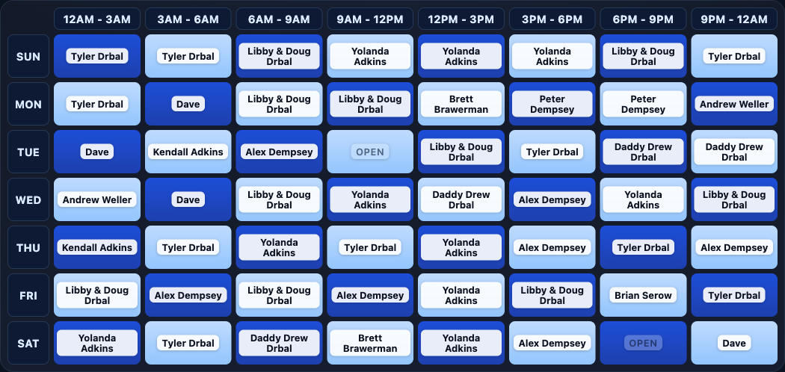
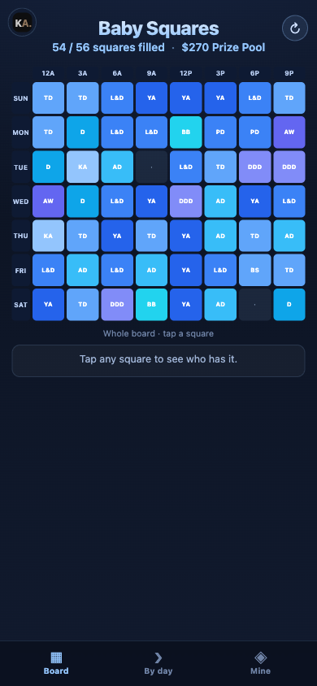

<div align="center">

# 🍼 Baby Squares

**A Super Bowl-style squares pool for guessing when the baby arrives.**

Everyone picks squares. Each square is a day and a time window. When the baby
shows up, whoever holds that square takes the pot.



</div>

---

## How it works

The board is a grid: **days down the side, time blocks across the top**. Every
square belongs to one person. Names are shuffled into place once and frozen, so
the board is fair and fixed before the guessing starts.

Open the page and hit reveal. Names pop in one by one, the open squares fade in
after, and the roster fills in below. Whoever owns the square matching the real
birth day and time wins.

The stats line tracks the pool in real time: how many squares are filled and how
much is riding on it, at **$5 per square** by default.

## On a phone

The board reshapes for small screens instead of shrinking to nothing. A bottom
tab bar switches between three views:

| Board | By day | Mine |
| :---: | :---: | :---: |
| The whole grid, color-coded, tap any square to see who has it | Swipe through one day at a time, fully readable | Tap your name and see exactly which squares are yours |

<div align="center">

</div>

## Run your own board

You need [Node](https://nodejs.org). Then:

```bash
npm install
npm run dev        # local preview at localhost:5173
```

1. **Edit `src/config.json`** — the title, subtitle, the day labels, the price
   per square, and the `roster` (one entry per person: `{ "name": "...",
   "squares": N }`).
2. **Freeze the board:**
   ```bash
   npm run shuffle
   ```
   This scatters the roster into the grid and writes `src/placement.json`. The
   time columns auto-scale to the crowd: the more people play, the finer the day
   is sliced (from one all-day block up to eight 3-hour blocks). Every run makes
   a fresh random board, so re-run until you like the layout, then commit it.
3. **Build and deploy:**
   ```bash
   npm run build
   ```

Unfilled squares render as `OPEN`. If the roster overflows the biggest board
(7 days times 8 blocks = 56 squares), `shuffle` warns you and drops the extras.

## Deploy

Built for [Vercel](https://vercel.com). Import the repo, keep the defaults
(`vercel.json` sets the Vite preset, `npm run build`, and `dist/` output), and
ship. It is a static site, so any static host works too.

## Under the hood

React 18, TypeScript, and Vite. No backend, no database, no tracking. The reveal
is CSS animation driven by per-square delays; the whole thing is one page that
runs entirely in the browser.

<div align="center">
<sub>Built by <a href="https://kendalladkins.dev">Kendall Adkins</a></sub>
</div>
